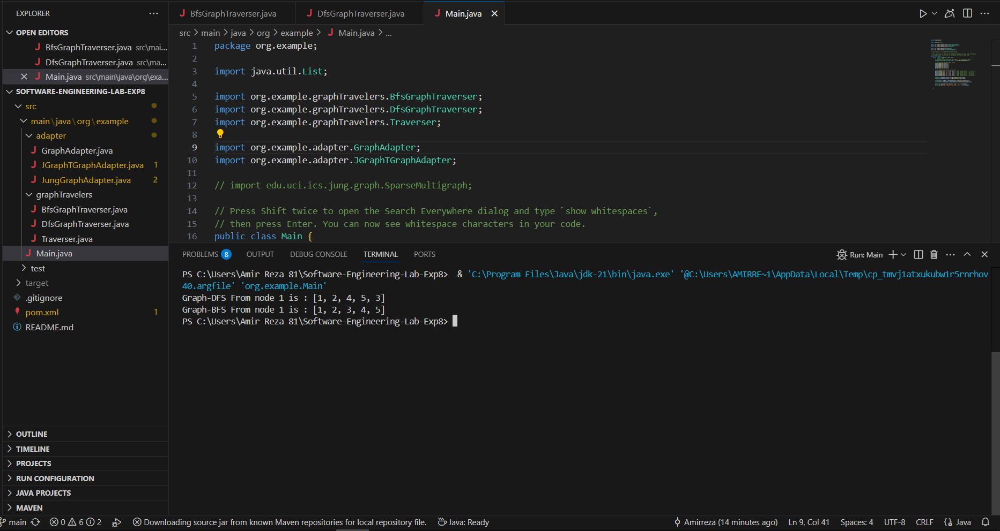

# آزمایش هشتم - الگوها در مهندسی  نرم‌افزار

## بخش اول

### انتخاب Adapter  
در این پروژه تصمیم بر استفاده از **الگوی Object Adapter** گرفته شد تا سه هدف اصلی محقق شود:

۱. **انعطاف‌پذیری زمان اجرا**  
با به‌کارگیری Object Adapter، امکان انتخاب یا تعویض پیاده‌سازی گراف (مثلاً JUNG یا JGraphT) در زمان اجرا فراهم می‌شود. به عبارت دیگر کافی است تنها نمونه‌ی Adapter مربوطه را تغییر دهیم تا کل سیستم بر پایه‌ی آن کار کند، بی‌آنکه نیازی به ویرایش یا کامپایل مجدد سایر کلاس‌ها باشد.

۲. **محدودیت‌های وراثت جاوا**  
جاوا از وراثت چندگانه پشتیبانی نمی‌کند؛ در حالی که Class Adapter بر مبنای وراثت مستقیم از یک کلاس گراف و یک interface کار می‌کند. با استفاده از ترکیب (composition) در Object Adapter، می‌توانیم بدون نیاز به وراثت چندگانه، همزمان رفتار interface مشترک و امکانات کلاس‌های concrete گراف را در یک Adapter گردآوری کنیم.

۳. **پنهان‌سازی جزئیات و کپسوله‌سازی**  
کلاس‌های traverser تنها با interface انتزاعی `GraphAdapter<V,E>` در ارتباط هستند، و هیچ‌گاه از جزئیات داخلی JUNG یا JGraphT مطلع نمی‌شوند. این کپسوله‌سازی تضمین می‌کند که تغییر یا ارتقای کتابخانه‌ی زیرساختی هیچ‌گاه به اصلاح کد traverser منجر نخواهد شد.

---

### نحوه پیاده سازی

#### تعریف رابط عمومی

برای جداسازی منطق traverser از پیاده‌سازی خاص گراف، یک interface عمومی با نام `GraphAdapter<V, E>` تعریف شده است. این interface چهار عملیات اصلی را در اختیار Adapterها قرار می‌دهد:

- `addVertex(V v)`: برای افزودن یک رأس به گراف  
- `addEdge(E e, V v1, V v2)`: برای افزودن یال بین دو رأس  
- `getNeighbors(V v)`: برای بازیابی لیست همسایه‌های یک رأس مشخص  
- `getVertices()`: برای دریافت تمام رئوس موجود در گراف  

این انتزاع باعث می‌شود کد traverser فقط به مفاهیم منطقی گراف وابسته باشد و هرگز با API خاص JGraphT یا JUNG درگیر نشود.

```java
public interface GraphAdapter<V,E> {
    void addVertex(V v);
    void addEdge(E e, V v1, V v2);
    Collection<V> getNeighbors(V v);
    Collection<V> getVertices();
}
```

#### نکات کلیدی پیاده‌سازی


**JGraphTGraphAdapter**  

در پیاده‌سازی مربوط به JGraphT، کلاس SimpleGraph مورد استفاده قرار گرفته است. هنگام افزودن یال، ابتدا بررسی می‌شود که دو رأس در گراف وجود داشته باشند یا نه. در صورت نبود، ابتدا آن‌ها افزوده می‌شوند و سپس یال ایجاد می‌شود:  

```java
internalGraph.addEdge(v1, v2);
```

**JungGraphAdapter**  

در سمت دیگر، پیاده‌سازی JUNG مبتنی بر کلاس SparseMultigraph است. در اینجا قبل از افزودن یال، بررسی می‌شود که آیا هر دو رأس قبلاً در گراف اضافه شده‌اند یا نه. اگر هر دو رأس موجود باشند، یال افزوده می‌شود:

```java
if (graph.containsVertex(v1) && graph.containsVertex(v2)) {
    graph.addEdge(edge, v1, v2);
}
```

این ساختار باعث شده که traverserها فقط با GraphAdapter کار کنند و از جزئیات هر کتابخانه بی‌اطلاع بمانند. در نتیجه، اگر در آینده نیاز باشد از کتابخانه‌ای جدید استفاده شود یا کتابخانه فعلی تغییر کند، تنها کافی‌ست یک Adapter جدید مطابق با همان interface نوشته شود و کل سیستم بدون تغییر در کلاس‌های دیگر با آن سازگار خواهد بود.

## بخش دوم

### زیربخش اول
تغییر کتابخانه با روشی ساده انجام شد. جزئیات کتابخانه جدید که در بخش قبل‌تر توضیح داده شد و صرفا در Main از کتابخانه جدید نمونه ساختیم.
تغییرات کلی و نسخه جدید Mian در زیر است:

``` java
package org.example;

import java.util.List;

import org.example.graphTravelers.BfsGraphTraverser;
import org.example.graphTravelers.DfsGraphTraverser;
import org.example.graphTravelers.Traverser;

import org.example.adapter.GraphAdapter;
import org.example.adapter.JGraphTGraphAdapter;

// import edu.uci.ics.jung.graph.SparseMultigraph;

// Press Shift twice to open the Search Everywhere dialog and type `show whitespaces`,
// then press Enter. You can now see whitespace characters in your code.
public class Main {
    public static void main(String[] args) {
        // Create a graph
        // SparseMultigraph<Integer,String> graph = new SparseMultigraph<>();
        // GraphAdapter<Integer, String> graphAdapter = new JungGraphAdapter<>();
        GraphAdapter<Integer,String> graph = new JGraphTGraphAdapter<>();

        // Add vertices (using Integer nodes)
        graph.addVertex(1);
        graph.addVertex(2);
        graph.addVertex(3);
        graph.addVertex(4);
        graph.addVertex(5);

        // Add edges (using String identifiers)
        graph.addEdge("E1", 1, 2); // Edge between Vertex 1 and Vertex 2
        graph.addEdge("E2", 1, 3); // Edge between Vertex 1 and Vertex 3
        graph.addEdge("E3", 2, 4); // Edge between Vertex 2 and Vertex 4
        graph.addEdge("E4", 3, 5); // Edge between Vertex 3 and Vertex 5
        graph.addEdge("E5", 4, 5); // Edge between Vertex 4 and Vertex 5

        Traverser dfsGraphTraveler= new DfsGraphTraverser(graph);
        Traverser bfsGraphTraveler= new BfsGraphTraverser(graph);

        List<Integer> dfsPath = dfsGraphTraveler.traverse(1);
        List<Integer> bfsTraveler = bfsGraphTraveler.traverse(1);

        System.out.println("Graph-DFS From node 1 is : " + dfsPath);
        System.out.println("Graph-BFS From node 1 is : " + bfsTraveler);


    }
}
```
نسخه قدیمی حذف نشده‌اند و صرفا کامنت شده‌اند.

هم‌چنین هیچ تغییر خاصی در پیاده‌سازی الگوریتم‌های `BFS` و `DFS` انجام نشده است. در نهایت درستی کد را نیز چک کردیم و خروجی به شکل زیر می‌باشد.



### زیربخش دوم
#### مهاجرت از JUNG به JGraphT

در فرآیند جایگزینی کتابخانه‌ی JUNG با JGraphT، تفاوت‌های قابل‌توجهی در طراحی، نحوه‌ی استفاده از API و مدل‌سازی گراف مشاهده شد. این بخش به مرور مهم‌ترین چالش‌ها و تصمیمات فنی اتخاذشده در این مسیر می‌پردازد:

- #### ساختاردهی اولیه‌ی گراف

  در JUNG، ایجاد گراف با استفاده از `new SparseMultigraph<>()` به سادگی انجام می‌شد.  
  در مقابل، JGraphT نیازمند مشخص‌کردن نوع کلاس یال در زمان ساختاردهی گراف است. به‌عنوان مثال:

  ```java
  Graph<String, DefaultEdge> graph = new SimpleGraph<>(DefaultEdge.class);
  ```

  این تفاوت در طراحی، مستلزم دقت بیشتر در زمان انتخاب کلاس گراف و یال‌هاست، به‌ویژه در سناریوهایی که یال‌ها دارای اطلاعات اضافی هستند.

- #### تفاوت‌های API و افزودن یال

  در JUNG، افزودن یال به گراف با استفاده از شیء یال صریح و دو رأس مشخص صورت می‌گیرد:

  ```java
  graph.addEdge(edgeObject, v1, v2);
  ```

  در JGraphT، متد `addEdge(v1, v2)` مستقیماً دو رأس را دریافت می‌کند و شیء یال را خود بازمی‌گرداند:

  ```java
  DefaultEdge e = graph.addEdge(v1, v2);
  ```

  این تغییر در سبک API ممکن است نیاز به بازنگری در بخش‌هایی از کد داشته باشد که به شیء یال به‌عنوان یک موجودیت مستقل وابسته هستند.

- #### مدیریت یال‌ها و داده‌های همراه

  یکی از ویژگی‌های مثبت JUNG امکان مدل‌سازی یال‌ها به‌صورت اشیای کامل با داده‌های دلخواه (از جمله برچسب یا وزن) بود.  
  در مقابل، JGraphT زمانی که از کلاس‌هایی مانند `DefaultEdge` استفاده می‌شود، امکان ذخیره‌سازی اطلاعات اضافی روی یال را به‌صورت پیش‌فرض فراهم نمی‌کند.

 **تصمیم پیاده‌سازی**: در این مهاجرت، برچسب‌های یال به‌طور موقت در آداپتور JGraphT نادیده گرفته شده‌اند. در صورت نیاز آینده، می‌توان با تعریف کلاس یال سفارشی، این اطلاعات را حفظ کرد.

- #### نحوه‌ی استخراج همسایه‌ها

  JUNG متدی مستقیم برای بازیابی همسایه‌های یک رأس ارائه می‌کرد:

  ```java
  graph.getNeighbors(vertex);
  ```

  در JGraphT چنین متدی در API اصلی وجود ندارد. برای به‌دست‌آوردن همسایه‌ها، لازم است ابتدا یال‌های متصل به رأس را دریافت کرده و سپس رأس مقابل را استخراج کرد:

  ```java
  Set<DefaultEdge> edges = graph.edgesOf(vertex);
  for (DefaultEdge edge : edges) {
      String neighbor = Graphs.getOppositeVertex(graph, edge, vertex);
  }
  ```

  اگرچه این روش منعطف‌تر است، اما در مقایسه با JUNG، نیاز به کدنویسی بیشتری دارد.

- #### تنوع در ساختارهای گراف در JGraphT

  از مزایای قابل‌توجه JGraphT، پشتیبانی گسترده از انواع مختلف گراف‌ها است. این کتابخانه کلاس‌هایی مانند  
  `DirectedGraph`، `WeightedGraph`، و `Pseudograph` را در اختیار توسعه‌دهندگان قرار می‌دهد.  
  این تنوع، انتخاب ساختار متناسب با نیاز پروژه را آسان‌تر می‌سازد و در آینده، قابلیت گسترش بیشتری فراهم می‌کند.


## بخش سوم

### سوال اول
استفاده از الگوی Strategy در این پروژه انتخاب مناسبی است، چون به ما امکان می‌دهد الگوریتم‌های مختلف پیمایش مانند DFS و BFS را از یکدیگر جدا و مستقل نگه داریم. به این ترتیب، هر الگوریتم به صورت یک "استراتژی" مجزا پیاده‌سازی شده و در نتیجه می‌توان آن‌ها را در زمان اجرا به راحتی با هم جایگزین کرد بدون نیاز به تغییر در ساختار گراف یا منطق اصلی برنامه.

این رویکرد باعث افزایش انعطاف‌پذیری کد و همچنین رعایت اصل Open/Closed در طراحی شی‌گرا می‌شود؛ یعنی برنامه برای اضافه کردن استراتژی‌های جدید باز است ولی نیازی به تغییر در بخش‌های قبلی ندارد.

### سوال دوم
برای پیاده‌سازی الگوی Strategy، ابتدا یک رابط (interface) به‌نام مثلاً ```GraphDisplayStrategy``` تعریف می‌شود که متدهایی مانند display(Graph g) را شامل شود. سپس برای هر روش نمایش (مثلاً ماتریس مجاورت، لیست مجاورت و ...) یک کلاس جداگانه پیاده‌سازی می‌شود که این رابط را پیاده می‌کند. در نهایت، کلاس اصلی گراف یک شی از نوع Strategy به عنوان فیلد نگه می‌دارد و در زمان نمایش از آن استفاده می‌کند.
